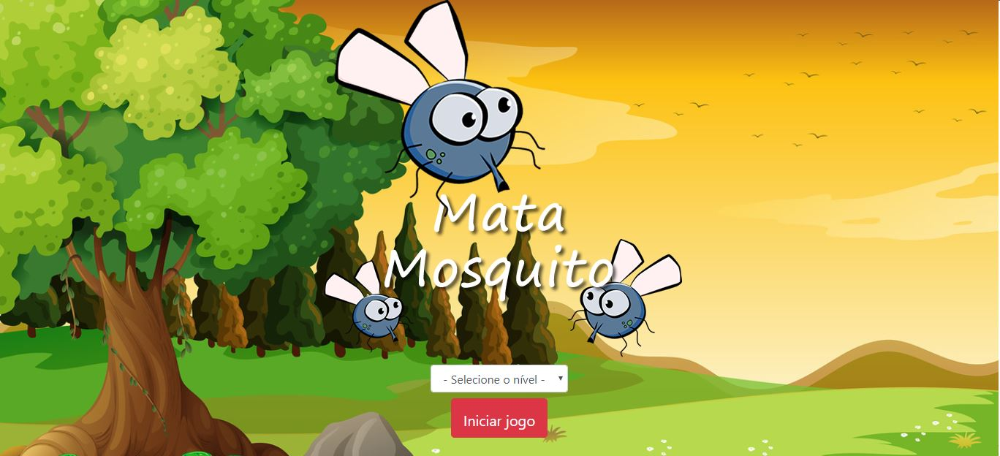

# App-Mata_Mosquito

Projeto contruido com HTML5, CSS3, Bootatrap 4 e Java Scritp puro.

## Instalação
Para utilizar essa aplicação, basta cloner esse projeto e inicializar o INDEX.HTML

## Como funciona
O projeto foi desenvolvido, para abordar os principais conceitos de criação de elementos.

O jogo e bem simples, onde o objetivo e matar o maximo de mosquitos, antes que o tempo acabe. Caso o jogador não conseguir matar ele some e perdemos uma vida.
